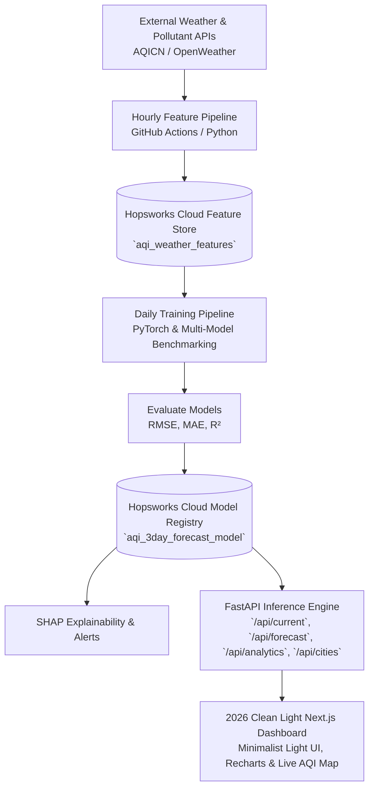

# Pearls AQI Predictor 🇵🇰💨

> **End-to-End Serverless Machine Learning Pipeline for 3-Day Air Quality Index (AQI) Forecasting across Pakistan**

Pearls AQI Predictor is an enterprise-grade, serverless ML solution designed to forecast city Air Quality Index (AQI) up to 3 days (72 hours) in advance across major Pakistan cities (**Lahore, Karachi, Islamabad, Rawalpindi, Peshawar, Quetta, Multan, Faisalabad, Sialkot, Gujranwala, Hyderabad**). It features automated hourly feature engineering, daily model retraining with **PyTorch** and Scikit-learn, model explainability via **SHAP**, real-time hazardous AQI alerts, and a **2026 Clean Light Design** Next.js web dashboard with live AQICN map overlays.

---

## 🌟 Key Architecture & Features



### 1. ⚙️ Feature Pipeline & Data Engineering
- **Data Ingestion**: Real-time ground station pollutant readings (`pm25`, `pm10`, `no2`, `so2`, `co`, `o3`) powered by AQICN API token (`AQICN_API_KEY`) and OpenWeather API.
- **Engineered Features**: Time-based cyclical encodings (`sin_hour`, `cos_hour`, `sin_month`, `cos_month`), rolling metrics (6h/24h averages), pollutant ratios (`pm25_to_pm10_ratio`), and AQI change rates.
- **Hopsworks Feature Store**: Synced with Hopsworks Cloud (`eu-west.cloud.hopsworks.ai` / `aqipredictor10pearls`) and local fallback cache (`data_cache.csv`).

### 2. 🤖 Model Training (PyTorch & Scikit-Learn) & Hopsworks Registry
- **Multi-Model Comparison**: Trains and evaluates **PyTorch Deep Neural Networks (`PyTorchAQIRegressor`)**, **Random Forest**, **Ridge Regression**, and **HistGradientBoosting**.
- **Metrics**: Evaluates performance using Root Mean Squared Error (RMSE), Mean Absolute Error (MAE), and Coefficient of Determination (R²).
- **Model Registry**: Saves optimal model weights and versioned metrics directly to Hopsworks Model Registry (`aqi_3day_forecast_model`).

### 3. 📊 Analytics, SHAP Explainability & Alerts
- **SHAP (SHapley Additive exPlanations)**: Computes feature importance rankings to explain what drives 3-day AQI predictions.
- **Hazardous Alerts**: Automatically evaluates predictions against US AQI standard risk categories (Good, Moderate, Unhealthy for Sensitive Groups, Unhealthy, Very Unhealthy, Hazardous) and triggers emergency warnings with health advice.

### 4. ☀️ 2026 Clean Light Next.js Dashboard
- **Minimalist 2026 Aesthetic**: Light canvas (`#FAFAFA`), crisp border cards (`#E4E4E7`), high-contrast zinc typography, and zero gradient overlays.
- **Real-Time Speedometer Gauge**: Minimal AQI display with solid status pill badges.
- **3-Day Forecast Cards**: Daily predicted AQI bounds and risk levels for Day +1, Day +2, and Day +3.
- **72-Hour Continuous Forecast Curve**: Recharts high-contrast trajectory graph with safety reference lines.
- **Pollutant Grid**: Compact breakdown of PM2.5, PM10, NO2, SO2, CO, and O3.
- **Live AQI Station Map**: Interactive AQICN map layer centered on any selected Pakistan city.
- **Analytics & Benchmark Tab**: Interactive SHAP feature importance charts and model comparison tables.

### 5. 🔄 Automated GitHub Actions Workflows
- `feature_pipeline.yml`: Hourly GitHub Actions trigger (`0 * * * *`) updating the Hopsworks Cloud Feature Store (`aqipredictor10pearls`).
- `training_pipeline.yml`: Daily GitHub Actions trigger (`0 0 * * *`) updating model weights and registry metrics in Hopsworks Model Registry.

---

## 🛠️ Technology Stack

| Layer | Technology |
|---|---|
| **Core Language** | Python 3.10+ & JavaScript (ES6+) |
| **Deep Learning & ML** | PyTorch (`torch`), Scikit-Learn, SHAP, Pandas, NumPy |
| **Feature Store & Registry** | Hopsworks Cloud (`eu-west.cloud.hopsworks.ai`) |
| **Backend API** | FastAPI, Uvicorn, Pydantic |
| **Frontend Dashboard** | Next.js 14 (App Router), React, Tailwind CSS, Recharts, Lucide Icons |
| **Automation & CI/CD** | GitHub Actions |

---

## 🚀 Quick Start Guide

### 1. Environment Setup
Clone the repository and set up environment variables:
```bash
git clone https://github.com/Zeeshier/aqi-predictor-10pearls.git
cd aqi-predictor-10pearls
```

Create a `.env` file in the root directory (reference template in [.env.example](file:///c:/Users/Zeeshan%20Ahmad/Documents/GitHub/aqi-predictor-10pearls/.env.example)):
```env
HOPSWORKS_API_KEY=your_hopsworks_api_key_here
HOPSWORKS_PROJECT_NAME=aqipredictor10pearls
AQICN_API_KEY=ba13fdd59b92f056b7649386a4e1cb1ad07da9a5
OPENWEATHER_API_KEY=your_openweather_api_key_here
DEFAULT_CITY=Lahore
```

### 2. Python Environment & Backfill
```bash
# Install Python dependencies
pip install -r requirements.txt

# Run historical data backfill (generates feature store data)
python scripts/backfill_features.py

# Run ML model training & evaluation pipeline
python pipelines/training_pipeline.py
```

### 3. Launch FastAPI Backend
```bash
uvicorn api.main:app --reload --port 8000
```
- API Welcome & Endpoint Map: [http://127.0.0.1:8000/](http://127.0.0.1:8000/)
- OpenAPI Interactive Documentation: [http://127.0.0.1:8000/docs](http://127.0.0.1:8000/docs)

### 4. Launch Next.js Web Dashboard
```bash
cd dashboard
npm install
npm run dev
```
Open [http://localhost:3000](http://localhost:3000) to view the web dashboard.

---

## 🧪 Running Unit Tests

```bash
python -m pytest tests/
```

---

## 📄 License
This project is licensed under the Apache-2.0 License - see the [LICENSE](file:///c:/Users/Zeeshan%20Ahmad/Documents/GitHub/aqi-predictor-10pearls/LICENSE) file for details.