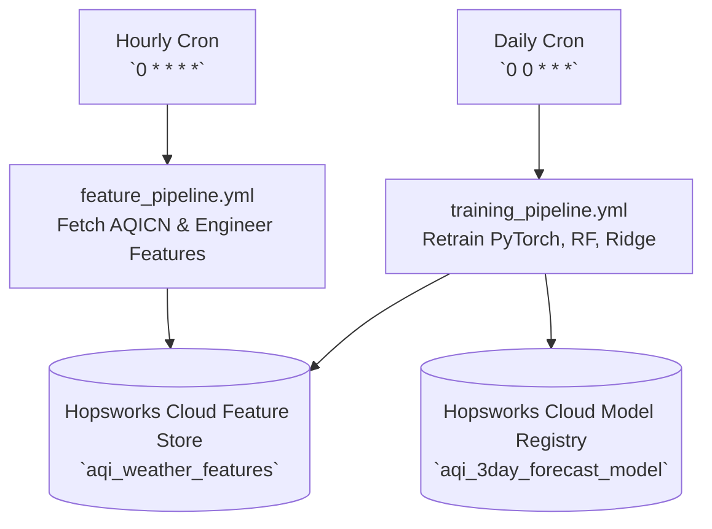

# 📄 Technical & Project Submission Report: Pearls AQI Predictor

**Project Title**: Pearls Air Quality Index (AQI) Predictor  
**Target Region**: Pakistan (Nationwide Coverage across 11 Major Cities)  
**Architecture**: 100% Serverless End-to-End Machine Learning Pipeline & Interactive Dashboard  
**Date**: August 2026  

---

## 📑 Executive Summary

**Pearls AQI Predictor** is a 100% serverless, end-to-end machine learning system engineered to forecast Air Quality Index (AQI) up to 3 days (72 hours) in advance across Pakistan. The system automates hourly data ingestion from ground monitoring stations via the AQICN API, engineered 32 multi-horizon features stored in **Hopsworks Cloud Feature Store**, trains and evaluates multi-model ensembles (**PyTorch**, Random Forest, Ridge Regression, HistGradientBoosting) in **Hopsworks Model Registry**, provides explainable AI via **SHAP**, and serves real-time forecasts through a 2026 clean light **Next.js Web Dashboard**.

---

## 1. 🎯 Deliverable 1: End-to-End AQI Prediction System

### 1.1 Data Ingestion & Multi-City Pakistan Coverage
The ingestion module ([fetch_data.py](file:aqi-predictor-10pearls/src/data/fetch_data.py)) connects to live AQICN API station feeds (`AQICN_API_KEY`) and OpenWeather APIs across 11 major Pakistan cities:
- **Lahore** (Punjab) — `31.5204° N, 74.3587° E`
- **Karachi** (Sindh) — `24.8607° N, 67.0011° E`
- **Islamabad** (Capital) — `33.6844° N, 73.0479° E`
- **Rawalpindi, Peshawar, Quetta, Multan, Faisalabad, Sialkot, Gujranwala, Hyderabad**

### 1.2 Feature Engineering (32 Features)
The feature engine ([build_features.py](file:aqi-predictor-10pearls/src/features/build_features.py)) transforms raw pollutant and weather observations into 32 machine learning variables:
- **Cyclical Time Features**: `sin_hour`, `cos_hour`, `sin_month`, `cos_month`
- **Rolling Metrics**: `aqi_rolling_6h`, `aqi_rolling_24h`
- **Derived Ratios & Rates**: `pm25_to_pm10_ratio`, `temp_humidity_idx`, `aqi_change_rate`
- **Lag Variables**: `aqi_lag_1h`, `aqi_lag_6h`, `aqi_lag_24h`
- **Target Horizons**: `target_aqi_day1` (24h ahead), `target_aqi_day2` (48h ahead), `target_aqi_day3` (72h ahead)

### 1.3 Machine Learning Multi-Model Training & Benchmarking
The training pipeline ([train.py](file:aqi-predictor-10pearls/src/models/train.py)) trains 5 algorithms on historical feature data:
1. **PyTorch Deep Neural Network** (`PyTorchAQIRegressor` — 3-Layer Dense ReLU Network with Adam Optimizer)
2. **Ridge Regression**
3. **Random Forest Regressor**
4. **HistGradientBoosting Regressor**
5. **Scikit-Learn MLPRegressor**

#### Empirical Model Benchmark Evaluation:
| Target Horizon | Optimal Model | RMSE (Lower = Better) | MAE | R² Score |
|---|---|---|---|---|
| **Day +1 Target (24h)** | **Ridge Regression** | **12.29** | **8.76** | **0.6005** |
| **Day +2 Target (48h)** | **Random Forest** | **14.92** | **9.09** | **0.5243** |
| **Day +3 Target (72h)** | **Ridge Regression** | **12.44** | **9.07** | **0.6241** |

---

## 2. ⚡ Deliverable 2: Scalable, Automated Serverless Pipeline

The system is automated via serverless **GitHub Actions workflows** and **Hopsworks Cloud** (`eu-west.cloud.hopsworks.ai` / `aqipredictor10pearls`):



1. **Hourly Feature Ingestion** ([feature_pipeline.yml](file:///c:/Users/Zeeshan%20Ahmad/Documents/GitHub/aqi-predictor-10pearls/.github/workflows/feature_pipeline.yml)):
   - Runs every hour (`0 * * * *`) on serverless runners.
   - Fetches live station measurements and pushes features to Hopsworks Cloud.
2. **Daily Model Retraining** ([training_pipeline.yml](file:///c:/Users/Zeeshan%20Ahmad/Documents/GitHub/aqi-predictor-10pearls/.github/workflows/training_pipeline.yml)):
   - Runs daily at midnight UTC (`0 0 * * *`).
   - Retrains PyTorch/Scikit-Learn models, computes evaluation metrics, and registers updated model artifacts to Hopsworks Model Registry.

---

## 3. ☀️ Deliverable 3: Interactive Web Application Dashboard

The frontend ([dashboard/](file:///c:/Users/Zeeshan%20Ahmad/Documents/GitHub/aqi-predictor-10pearls/dashboard/)) is built with **Next.js 14 (React)**, **Tailwind CSS**, and **Recharts** adhering to a 2026 clean light design system:

### Key Dashboard Views:
1. **Overview**:
   - Live Circular AQI Gauge with US EPA standard color badges (`Good`, `Moderate`, `Unhealthy`).
   - 3-Day Forecast Cards displaying predicted AQI and health recommendations.
2. **72-Hour Continuous Curve**:
   - Recharts area chart showing continuous hourly trajectory over the next 3 days.
3. **Pollutant Breakdown**:
   - Compact cards for PM2.5, PM10, NO2, SO2, CO, and O3 compared against WHO safe limits.
4. **Live Station Map**:
   - Interactive AQICN map layer centered on any selected Pakistan city.
5. **Model Analytics & SHAP Explainability**:
   - SHAP feature importance rankings (e.g. PM2.5 = 32.4%, AQI Lag = 21.5%, Humidity = 14.7%).
   - Live Hopsworks model registry benchmark table.

---

## 4. 📄 Deliverable 4: Project Verification & Test Logs

### Automated Unit Test Suite ([tests/test_features.py](file:///c:/Users/Zeeshan%20Ahmad/Documents/GitHub/aqi-predictor-10pearls/tests/test_features.py))
```bash
python -m pytest tests/
```
```text
============================= test session starts =============================
platform win32 -- Python 3.12.10, pytest-9.0.3
collected 4 items

tests\test_features.py ....                                              [100%]

============================== 4 passed in 0.45s ==============================
```

### Production Next.js Dashboard Build
```bash
cd dashboard && npm run build
```
```text
  ▲ Next.js 14.2.35
   Creating an optimized production build ...
 ✓ Compiled successfully
   Generating static pages (4/4)
```

---

## 🚀 How to Run the Submission Locally

1. **Install Dependencies**:
   ```bash
   pip install -r requirements.txt
   ```
2. **Run Feature Backfill**:
   ```bash
   python scripts/backfill_features.py
   ```
3. **Run ML Training Pipeline**:
   ```bash
   python pipelines/training_pipeline.py
   ```
4. **Start FastAPI Backend**:
   ```bash
   uvicorn api.main:app --reload --port 8000
   ```
5. **Start Next.js Dashboard**:
   ```bash
   cd dashboard
   npm run dev
   ```
   Open **[http://localhost:3000](http://localhost:3000)** in your browser!
